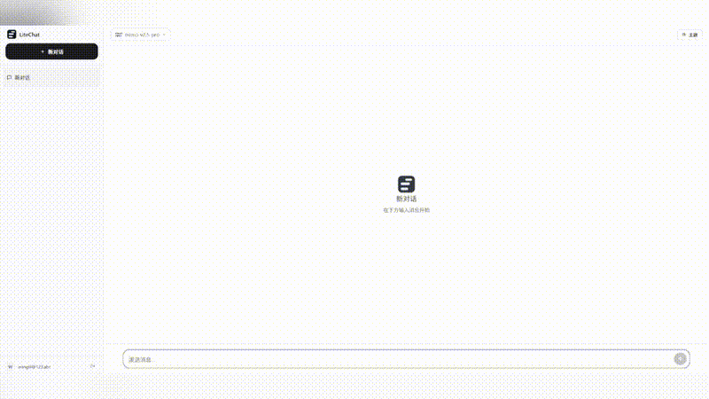
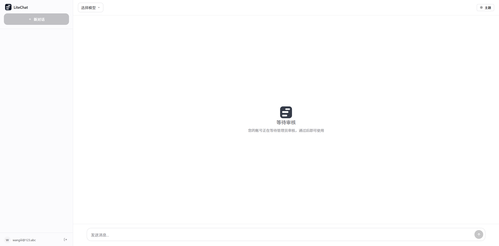
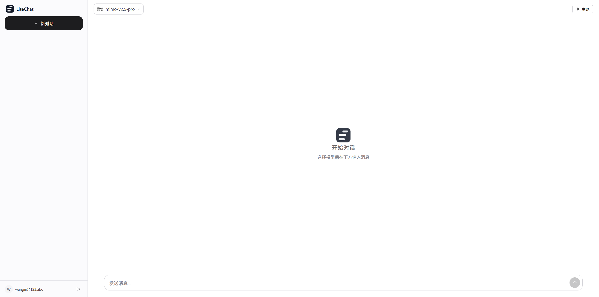
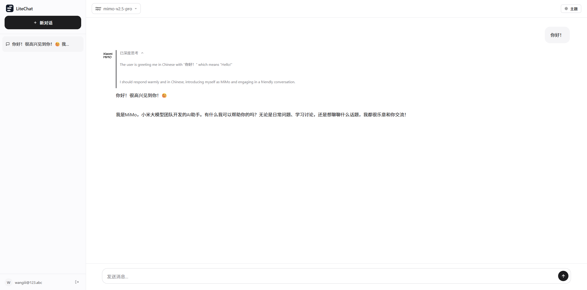

<p align="center">
  
</p>

<h1 align="center">LiteChat</h1>

<p align="center">
  轻量化、开箱即用的多用户 AI 对话网站
</p>

<p align="center">
  <a href="#特性">特性</a> •
  <a href="#快速开始">快速开始</a> •
  <a href="#截图">截图</a> •
  <a href="#管理面板">管理面板</a> •
  <a href="#技术栈">技术栈</a> •
  <a href="#协议">协议</a>
</p>

---

## 演示

<p align="center">
  
</p>

## 截图

<table>
  <tr>
    <td align="center">
      <br>
      <b>等待审核界面</b>
    </td>
    <td align="center">
      <br>
      <b>开始对话界面</b>
    </td>
  </tr>
  <tr>
    <td align="center" colspan="2">
      <br>
      <b>AI 对话界面</b>
    </td>
  </tr>
</table>

## 特性

- **零构建** — 纯 HTML/CSS/JS 前端，Node.js 单文件后端，无需 webpack/vite
- **多用户审核** — 开放注册，管理员审核通过后方可使用
- **多 API 提供商** — 支持同时配置多个 OpenAI 兼容 API（OpenAI / DeepSeek / Ollama 等）
- **流式输出** — SSE 实时推送，切换对话不中断
- **思考链** — 支持 DeepSeek R1 等推理模型的思考过程展示，折叠/展开动画
- **Markdown 渲染** — 完整支持标题、列表、表格、引用、代码块，HTML 代码可一键运行
- **深色/浅色主题** — 自由切换，Apple 风格黑白灰配色
- **响应式** — 桌面端和移动端自适应
- **精致动效** — Apple 设计原则，流畅的交互动画
- **Docker 部署** — 提供 Dockerfile 和 docker-compose

## 快速开始

### 方式一：Node.js

```bash
# 克隆项目
git clone https://github.com/WONGIII/LiteWebChatUI.git
cd LiteWebChatUI

# 安装依赖
npm install

# 启动服务
node server.js
```

浏览器打开 `http://localhost:3000`，首次访问自动进入管理员创建页面。

### 方式二：Docker

```bash
# 克隆项目
git clone https://github.com/WONGIII/LiteWebChatUI.git
cd LiteWebChatUI

# 启动容器
docker-compose up -d
```

访问 `http://localhost:3000`。

## 管理面板

<p align="center">
  
</p>

1. 创建管理员账号后自动跳转管理面板
2. 添加 API 提供商（Base URL + API Key）
3. 获取模型列表，或手动添加自定义模型
4. 上传模型 Logo
5. 控制模型可见性（公开 / 私密），支持批量操作
6. 管理用户（审核 / 驳回 / 删除）

## 技术栈

| 类别 | 技术 |
|------|------|
| **后端** | Node.js + better-sqlite3 + bcrypt |
| **前端** | HTML/CSS/JS（零依赖构建），Lucide 图标，highlight.js |
| **数据库** | SQLite（单文件，零配置） |
| **认证** | Session Cookie + bcrypt |
| **部署** | Docker + docker-compose |

## 环境变量

| 变量 | 默认值 | 说明 |
|------|--------|------|
| `PORT` | `3000` | 服务端口 |

## 项目结构

```
LiteWebChatUI/
├── public/
│   ├── index.html      # 主页面
│   ├── login.html      # 登录页面
│   ├── admin.html      # 管理面板
│   ├── app.js          # 主逻辑
│   ├── login.js        # 登录逻辑
│   ├── admin.js        # 管理逻辑
│   ├── style.css       # 样式
│   └── logo.svg        # Logo
├── server.js           # 后端服务
├── Dockerfile          # Docker 配置
├── docker-compose.yml  # Docker Compose
└── README.md
```

## 协议

<p align="center">
  MIT License © 2024-Present
</p>

---

<p align="center">
  Made with ❤️ by <a href="https://github.com/WONGIII">WONGIII</a>
</p>
